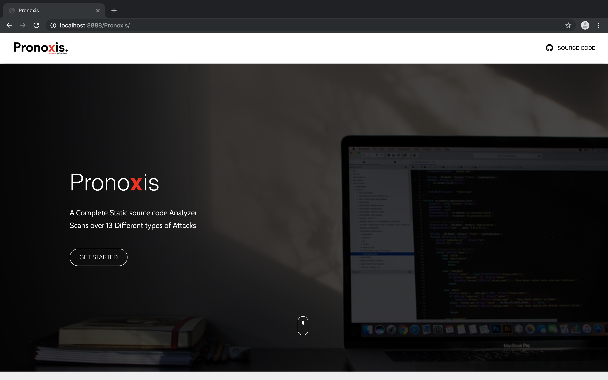
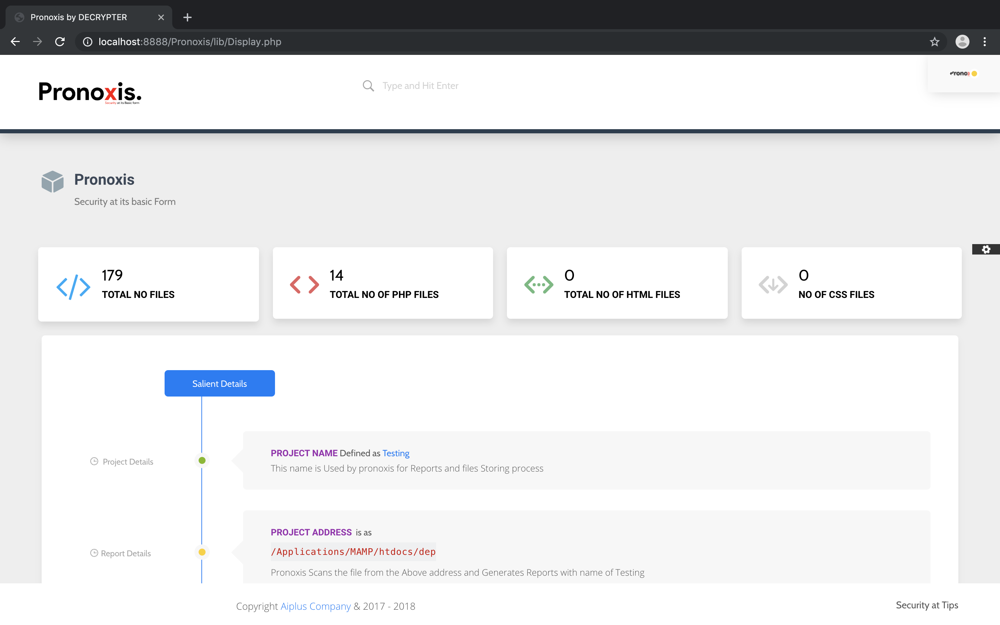

# Pronoxis
A PHP Vulnerability Source code Analyzer.

   This Scanner is purely built with PHP.

   Features of Pronoxis
 
  
  1.Scans Project file in 2 different way (Full scan and Partial Scan)
    i) Scans Whole Project at a time
    ii)Gives acces to user to Select a file for Scanning.

  2.Can test upto 13 different type of Top attacks.

  3.Can check the code with cannot be compiled.

  4.Tests code with out Compiling.

  5.Gives output in Material UI.

  6.Saved output as JSON format neat and clean way.

  7.Can scan upto 4000 lines of Code for every Second.

  
  
  Any Contribution to this Project is admirable.

   Looking forward for your contrubution 

   Contact at parshuram@primefort.net
   
   
Sample Images of Pronoxis

Project Details and Scanning File Details . :P

